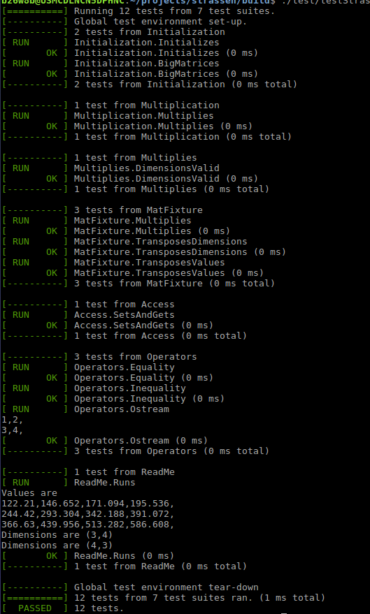

# Strassen

Linear algebra library that implements matrix transpose and multiplication. Named after [Volker Strassen](https://en.wikipedia.org/wiki/Volker_Strassen) famous for O(n^2.6) matrix multiplication algorithm. Assignment focused on API design rather than algo performance

## Design Choices

* Implemented as a template library. Care was taken to surface as many errors as possible at compile time rather than runtime
* Matrices are statically allocated so the size of matrices must be known at compile time
* Compile-time failures - matrix multiplication with invalid dimensions, matrix multiplication with unequal types
* Implements naive matrix multiplication. [Strassen's algorithm](https://en.wikipedia.org/wiki/Strassen_algorithm) and other very efficient matrix multiplication algos are only more efficient for large matrices and exact types like double. The error when using floats grows quickly.
* A variable size matrix library has the advantages of ease of use and less templating, but suffers from memory fragmentation which can potentially hurt performance. If a variable size matrix were needed I would implement it as a separate class (similar to Matrix2d vs MatrixXd in the popular linear algebra library Eigen)


## Building

* Requires cmake and a compiler that supports c++ 14 or later
* Also requires a connection to the internet and git, since gtest is downloaded as part of the build
* To build from root level directory (folder this README is in)

```bash
mkdir build
cd build
cmake ..
make -j
```


## Using

The best documentation are the unit tests located [here](./test/TestStrassen.cpp). 
Note to developer: Documentation below is unit tested. change unit test when documentation changes here

```C++
TEST(ReadMe, Runs) {
    strassen::Mat<double, 3, 2> lhs{{1.1, 2.2},  //  
                                    {3.3, 4.4},
                                    {5.5, 6.6}};
    strassen::Mat<double, 2, 4> rhs{{11.11, 22.22, 33.33, 44.44},  //  
                                    {55.55, 66.66, 77.77, 88.88}};
    strassen::Mat<double, 3, 4> expected{{134.431, 171.094, 207.757, 244.42},  //  
                                         {281.083, 366.63, 452.177, 537.724},
                                         {427.735, 562.166, 696.597, 831.028}};
    auto res = lhs * rhs;
    for (int32_t r = 0; r < 3; ++r) {
        for (int32_t c = 0; c < 4; ++c) {
            // doubles can be slightly off and haven't written approx equality function
            EXPECT_THAT(res.get(r, c), DoubleEq(expected.get(r, c)));
        }   
    }   
    std::cerr << "Values are\n" << res;
    EXPECT_THAT(res.dim().first, Eq(3));
    EXPECT_THAT(res.dim().second, Eq(4));
    std::cerr << "Dimensions are (" << res.dim().first << ',' << res.dim().second << ")\n";

    auto tres = res.transpose();
    EXPECT_THAT(tres.dim().first, Eq(4));
    EXPECT_THAT(tres.dim().second, Eq(3));
    std::cerr << "Dimensions are (" << tres.dim().first << ',' << tres.dim().second << ")\n";
    SUCCEED();
}

```

## Testing

Run the executable `${BUILD_DIR}/test/testStrassen`


